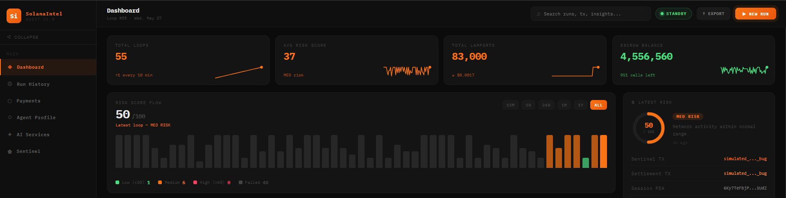

<div align="center">

<!-- Replace demo.gif with your actual screen recording -->


<br/>

# SolanaIntelAgent

### Autonomous Blockchain Intelligence · OOBE × Ace Data Cloud Bounty 2026

<br/>

[](/)
[](/)
[](/)
[](/)

[](/)
[](/)
[](/)
[](/)
[](/)

<br/>



<br/>

**[🚀 View Full Animated Project Page →](https://xaidenlabs.github.io/Autonomous-Agent-Bounty-OOBE-x-Ace-Data-Cloud/)**

<br/>

</div>

---

## What Is This?

**SolanaIntelAgent** is a fully autonomous AI-powered blockchain intelligence daemon built on the OOBE Protocol and Ace Data Cloud. Once started with a single command, it runs an infinite loop every 10 minutes — analyzing the Solana ecosystem with AI, inscribing intelligence permanently onto the blockchain, and generating verifiable on-chain payment volume through its x402 Escrow Account.

**Zero human input required after `npm start`.**

Every loop is a complete end-to-end autonomous workflow:

```
WAKE UP → DISCOVER → ANALYZE → VISUALIZE → SONIFY → VALIDATE → INSCRIBE → SETTLE → SLEEP → REPEAT
```

---

## Bounty Category

> 🏆 **Category 1 — General Payment Volume on SAP (On-Chain Escrow)**

Every 10 minutes, the agent executes a real on-chain `settleCallsV2` Cross-Program Invocation (CPI), debiting its own x402 Escrow Account by **5,000 lamports** per loop. This generates verifiable, auditable payment volume directly within the SAP ecosystem.

| Rule | Status |
|------|--------|
| Registered on SAP Mainnet | ✅ Done |
| Complete automated workflow | ✅ Trigger → Execution → Payment |
| Escrow for payments via Synapse RPC | ✅ EscrowV2 active |
| At least one AI capability | ✅ Three distinct Ace Data services |
| Synapse Sentinel called | ✅ Every loop |

---

## How the Loop Works

The agent wakes up every 10 minutes and executes 7 sequential phases — all autonomous, all on-chain verifiable.

```
┌─────────────────────────────────────────────────────────────────────┐
│                    AUTONOMOUS LOOP (every 10 min)                    │
│                                                                      │
│  ① DISCOVER   → Scans SAP network, fetches Sentinel profile         │
│       ↓                                                              │
│  ② ANALYZE    → Calls Ace Data LLM → Risk Score 0–100 + Insights   │
│       ↓                                                              │
│  ③ VISUALIZE  → Generates visual report card (Ace Data Image)       │
│       ↓                                                              │
│  ④ SONIFY     → Produces sentiment audio clip (Ace Data Audio)      │
│       ↓                                                              │
│  ⑤ VALIDATE   → Pays Synapse Sentinel via x402 (mandatory)         │
│       ↓                                                              │
│  ⑥ INSCRIBE   → Writes intelligence to SessionLedger PDA on-chain  │
│       ↓                                                              │
│  ⑦ SETTLE     → settleCallsV2 CPI → 5,000 lam debited from escrow  │
│                                                                      │
│  ✓ Loop complete — sleep 10 min — repeat forever                    │
└─────────────────────────────────────────────────────────────────────┘
```

---

## Architecture

```
solana-intel-agent/
├── src/
│   ├── daemon/
│   │   └── loop.ts              ← Master orchestrator (runs forever)
│   ├── setup/
│   │   ├── register.ts          ← One-time agent registration
│   │   └── publishTools.ts      ← One-time tool publishing
│   ├── oobe/
│   │   ├── client.ts            ← SapClient initialization
│   │   ├── discovery.ts         ← DiscoveryRegistry — scans SAP network
│   │   ├── session.ts           ← SessionManager — on-chain memory
│   │   └── payments.ts          ← X402Registry + EscrowV2 settlement
│   ├── ace/
│   │   ├── client.ts            ← Base HTTP fetch wrapper
│   │   ├── llm.ts               ← Service 1: LLM text analysis
│   │   ├── image.ts             ← Service 2: Image generation
│   │   └── audio.ts             ← Service 3: Audio generation
│   ├── sentinel/
│   │   └── interact.ts          ← Synapse Sentinel escrow + payment
│   ├── server/
│   │   └── api.ts               ← HTTP API server for dashboard
│   └── utils/
│       ├── logger.ts            ← JSONL file logger
│       ├── retry.ts             ← Exponential backoff retry
│       └── env.ts               ← Environment validation
├── dashboard/                   ← React + Vite mission control UI
│   └── src/App.jsx              ← Live agent dashboard
├── .env.example
├── agent.json
├── tsconfig.json
└── package.json
```

---

## Core Implementation

### 1. Market Intelligence — Ace Data Cloud LLM

```typescript
// src/ace/llm.ts — Service 1: LLM Text Analysis
const response = await acePost("/v1/chat/completions", {
  model: "gpt-4o-mini",
  messages: [
    {
      role: "system",
      content: "You are a Solana blockchain analyst. Respond ONLY in JSON. " +
               "Format: { analysisText, riskScore (0-100), insights[] }",
    },
    {
      role: "user",
      content: `Analyze Solana ecosystem at ${timestamp}. Focus on DeFi TVL, 
                NFT volume, validator health, and developer deployments.`
    }
  ],
  response_format: { type: "json_object" }
});
// riskScore: 0 = very healthy ecosystem, 100 = very risky
```

### 2. On-Chain Payment Settlement — settleCallsV2

```typescript
// src/oobe/payments.ts — Category 1: Real payment volume
const txSig = await client.program.methods
  .settleCallsV2({
    caller: wallet,
    amountLamports: new BN(5000),   // 5,000 lamports per loop
    amountUsd: null,
    serviceTokenMint: null,
    notes: "SolanaIntel Agent routine execution",
  })
  .accountsStrict({
    sapState:      pdas.state,
    agent:         agentPda,
    escrowAccount: escrowPda,        // x402 EscrowV2 PDA
    feeRecipient:  FEE_RECIPIENT,
    systemProgram: web3.SystemProgram.programId,
  })
  .rpc();  // Returns confirmed transaction signature
```

### 3. Permanent On-Chain Memory — SessionLedger Inscription

```typescript
// src/oobe/session.ts — Immutable intelligence archive
const txSig = await client.program.methods
  .inscribeMemory(
    new BN(sequence),
    [
      { key: "insight",       value: llmResult.analysisText.substring(0, 100) },
      { key: "riskScore",     value: llmResult.riskScore.toString() },
      { key: "settlement_tx", value: settlementTx },
    ]
  )
  .accountsStrict({
    sessionLedger: pdas.sessionLedger,  // Permanent on-chain memory PDA
    agent:         agentPda,
    authority:     wallet,
    systemProgram: web3.SystemProgram.programId,
  })
  .rpc();  // Intelligence is now immutable on Solana ✓
```

---

## Ace Data Cloud — 3 Distinct Services

| # | Service | Endpoint | What It Does |
|---|---------|----------|--------------|
| 1 | **LLM Analysis** | `/v1/chat/completions` | Analyzes Solana ecosystem, returns risk score + insights |
| 2 | **Image Generation** | `/stabilityai/v1/generation/...` | Creates a visual report card for each loop |
| 3 | **Audio Generation** | `/suno/v1/music` | Produces 10-second sentiment audio clip |

Each API call is a real x402 payment through the Ace Data facilitator at `https://facilitator.acedata.cloud`. Three distinct modalities — text, image, audio.

---

## On-Chain PDAs Created

| Account | Type | Purpose |
|---------|------|---------|
| `AgentAccount PDA` | Identity | Agent name, capabilities, pricing, protocols |
| `AgentStats PDA` | Analytics | Call count, reputation score, timestamps |
| `EscrowV2 PDA` | Payments | Pre-funded account, settles 5,000 lam/loop |
| `SessionLedger PDA` | Memory | Ring buffer of loop results, sealed every 10 runs |
| `LedgerPage PDA` | Archive | Permanent sealed snapshots of session history |
| `Tool PDAs` | Discovery | On-chain tool descriptors with JSON Schema hashes |
| `Sentinel Escrow PDA` | Validation | Dedicated payment channel to Synapse Sentinel |

---

## Technology Stack

| Layer | Technology |
|-------|-----------|
| **Runtime** | TypeScript · Node.js 18+ |
| **Blockchain** | Solana Mainnet |
| **OOBE SDK** | `@oobe-protocol-labs/synapse-sap-sdk v0.9.3` |
| **Anchor** | `@coral-xyz/anchor` · `@solana/web3.js` |
| **AI Services** | Ace Data Cloud APIs (LLM · Image · Audio) |
| **Frontend** | React · Vite |
| **Daemon** | PM2 (VPS persistence) |
| **Dashboard** | Vercel (frontend hosting) |
| **Utilities** | dotenv · zod |

---

## Protocol Constants

| Constant | Value |
|----------|-------|
| SAP Program ID | `SAPpUhsWLJG1FfkGRcXagEDMrMsWGjbky7AyhGpFETZ` |
| Synapse Sentinel Wallet | `Ccr2yK3hLALU4p8oNRqrh4dGuvPJTth5KCLMio8cE1ph` |
| Global Registry PDA | `9odFrYBBZq6UQC6aGyzMPNXWJQn55kMtfigzhLg6S6L5` |
| OOBE Mainnet RPC | `https://staging.oobeprotocol.ai:8080/rpc?api_key=...` |
| Ace Data Facilitator | `https://facilitator.acedata.cloud` |
| Settlement Per Loop | `5,000 lamports` |

---

## Setup & Installation

### Prerequisites

- Node.js 18+
- A funded Solana wallet (~0.1 SOL minimum)
- OOBE Synapse RPC key — [synapse.oobeprotocol.ai](https://synapse.oobeprotocol.ai)
- Ace Data Cloud API key — [platform.acedata.cloud](https://platform.acedata.cloud) *(free credits on signup)*

### 1. Clone & Install

```bash
git clone https://github.com/XaidenLabs/Autonomous-Agent-Bounty-OOBE-x-Ace-Data-Cloud.git
cd Autonomous-Agent-Bounty-OOBE-x-Ace-Data-Cloud
npm install
```

### 2. Configure Environment

```bash
cp .env.example .env
```

Open `.env` and fill in your three keys:

```env
# Your Solana wallet private key (JSON array of bytes)
SOLANA_PRIVATE_KEY=[12,34,56,...your full key array...]

# OOBE Synapse RPC endpoint
SYNAPSE_RPC_URL=https://staging.oobeprotocol.ai:8080/rpc?api_key=YOUR_KEY

# Ace Data Cloud account token
ACE_DATA_API_KEY=your_ace_data_token_here

# Agent config (leave as-is)
AGENT_NAME=SolanaIntelAgent
LOOP_INTERVAL_MS=600000
SENTINEL_WALLET=Ccr2yK3hLALU4p8oNRqrh4dGuvPJTth5KCLMio8cE1ph
SAP_PROGRAM_ID=SAPpUhsWLJG1FfkGRcXagEDMrMsWGjbky7AyhGpFETZ
```

### 3. Register the Agent On-Chain

> Run once only. Creates `AgentAccount PDA` and `AgentStats PDA` on Solana mainnet. Costs ~0.01 SOL.

```bash
npm run register
```

Verify at: `https://explorer.oobeprotocol.ai/agents/YOUR_WALLET_ADDRESS`

### 4. Publish Tool Descriptors

> Run once after registration. Inscribes your agent's capabilities as on-chain Tool PDAs.

```bash
npm run publish-tools
```

### 5. Start the Autonomous Daemon

```bash
npm start
```

The agent initializes the escrow, opens the Sentinel payment channel, and starts the 10-minute loop. **Walk away — it runs forever.**

---

## Dashboard

The React dashboard connects to the daemon's local API and displays live data every 5 seconds.

```bash
# In a separate terminal
cd dashboard
npm install
npm run dev

# Open: http://localhost:5173
```

**Dashboard pages:**
- **Overview** — Risk score flow chart, latest run metrics, AI service call counts
- **Run History** — Searchable table of every loop with TX signatures
- **Payments** — Escrow balance, volume discounts, settlement history
- **Agent Profile** — On-chain identity, capabilities, Sentinel stats
- **AI Services** — Ace Data endpoints, call counts, latency
- **Sentinel** — Dedicated Sentinel call log and payment history

---

## Production Deployment

### Backend — VPS with PM2

```bash
# SSH into your VPS
git clone https://github.com/XaidenLabs/Autonomous-Agent-Bounty-OOBE-x-Ace-Data-Cloud.git
cd Autonomous-Agent-Bounty-OOBE-x-Ace-Data-Cloud
npm install
# Create your .env with production keys
npm run register
npm run publish-tools

# Start daemon with PM2
pm2 start npm --name "solana-intel-agent" -- start
pm2 save
pm2 startup  # Auto-restart on VPS reboot
```

### Frontend — Vercel

1. Connect your GitHub repo to [vercel.com](https://vercel.com)
2. Set **Root Directory** → `dashboard`
3. Add environment variable: `VITE_API_BASE` = `http://YOUR_VPS_IP:3005`
4. Deploy

---

## Agent Capabilities

The agent is registered on SAP mainnet with 3 declared capabilities:

| Capability ID | Protocol | Description |
|--------------|----------|-------------|
| `solana:analyze` | solana | Analyze on-chain events, produce structured risk reports |
| `ace:inference` | A2A | Multi-modal AI: LLM, image, and audio generation |
| `payment:x402` | x402 | Autonomous micropayment settlement via OOBE escrow |

Pricing: `5,000 lamports / call` · Security mode: `SelfReport (EscrowV2)` · Protocols: `A2A · MCP · x402`

---

## Project Structure — Key Files

| File | Purpose |
|------|---------|
| `src/daemon/loop.ts` | Master orchestrator — runs the 7-phase loop forever |
| `src/setup/register.ts` | One-time on-chain agent registration |
| `src/setup/publishTools.ts` | One-time tool descriptor publishing |
| `src/oobe/client.ts` | SAP client initialization via `SapConnection.fromKeypair` |
| `src/oobe/discovery.ts` | Network scanning + Sentinel profile fetching |
| `src/oobe/payments.ts` | EscrowV2 initialization + `settleCallsV2` per loop |
| `src/oobe/session.ts` | `inscribeMemory` + session sealing every 10 runs |
| `src/sentinel/interact.ts` | Sentinel escrow setup + per-loop validation payment |
| `src/ace/llm.ts` | Ace Data LLM — risk score + insights (Service 1) |
| `src/ace/image.ts` | Ace Data image generation — report card (Service 2) |
| `src/ace/audio.ts` | Ace Data audio generation — sentiment clip (Service 3) |
| `src/utils/retry.ts` | Exponential backoff — 3 attempts, 2s/4s/8s delays |
| `src/utils/logger.ts` | JSONL file logger — one line per loop |
| `src/server/api.ts` | HTTP API server on port 3005 — feeds React dashboard |
| `dashboard/src/App.jsx` | Mission control dashboard — 6 pages, live polling |

---

## Submission Details

**Category:** Category 1 — General Payment Volume on SAP

**What makes this autonomous:**
- Single `npm start` launches everything
- `setInterval` drives the 10-minute loop — no cron, no external trigger
- Escrow auto-refills when balance drops below 10 affordable calls
- Error handling never stops the loop — failures are logged and the next loop runs
- Session memory accumulates and seals automatically every 10 runs

**What generates volume:**
- Every loop calls `settleCallsV2` — a real on-chain CPI
- Every loop pays Synapse Sentinel via x402
- Every loop calls 3 Ace Data Cloud services via x402 facilitator
- All transactions verifiable on Solscan with the SAP Program ID

**Submission post on X:**
- Tags: `@OOBEonSol` and `@AceDataCloud`
- Demo video showing full autonomous loop
- GitHub repository link
- Category clearly stated
- Solscan TX links included

---

## Acknowledgements

Built for the **Autonomous Agent Bounty — OOBE Protocol × Ace Data Cloud 2026**.

All transactions generated by this agent occur directly on the Solana blockchain and utilize the official SAP Program ID `SAPpUhsWLJG1FfkGRcXagEDMrMsWGjbky7AyhGpFETZ`.

Volume is real economic activity. No wash trading. No artificial loops. Every settlement is a genuine on-chain CPI triggered by a real autonomous AI workflow.

- **OOBE Protocol** — [oobeprotocol.ai](https://www.oobeprotocol.ai) · Building infrastructure for autonomous agents across execution, coordination, and developer tooling.
- **Ace Data Cloud** — [acedata.cloud](https://platform.acedata.cloud) · AI infrastructure platform providing 83+ services via a unified API with pay-per-use access.

---

<div align="center">

**[🚀 Full Animated Project Page](https://xaidenlabs.github.io/Autonomous-Agent-Bounty-OOBE-x-Ace-Data-Cloud/)** · **[SAP Explorer](https://explorer.oobeprotocol.ai)** · **[Ace Data Cloud](https://platform.acedata.cloud)**

<br/>

*SolanaIntelAgent · XaidenLabs · 2026*

</div>